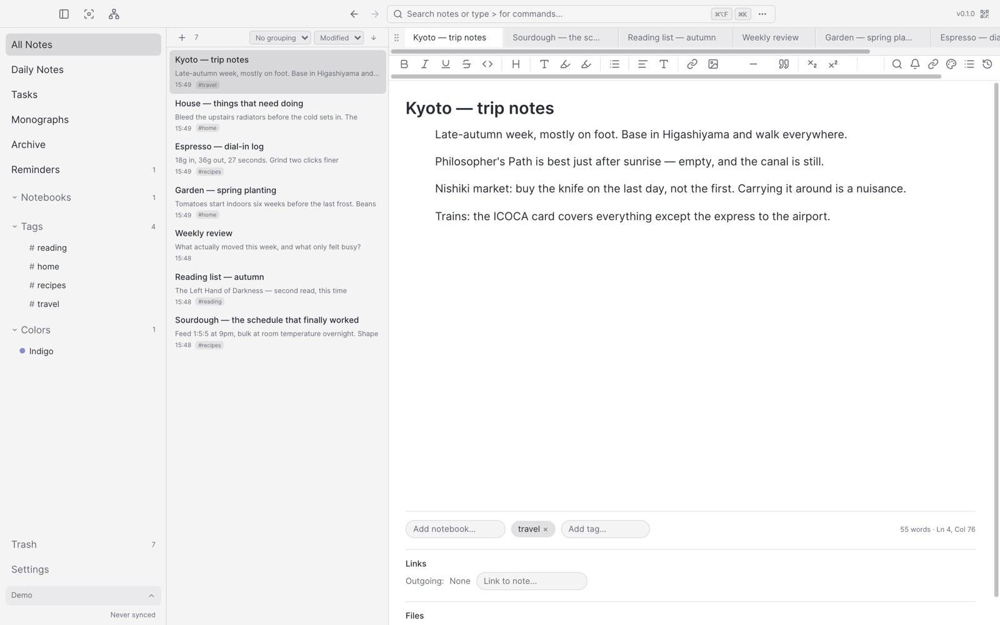
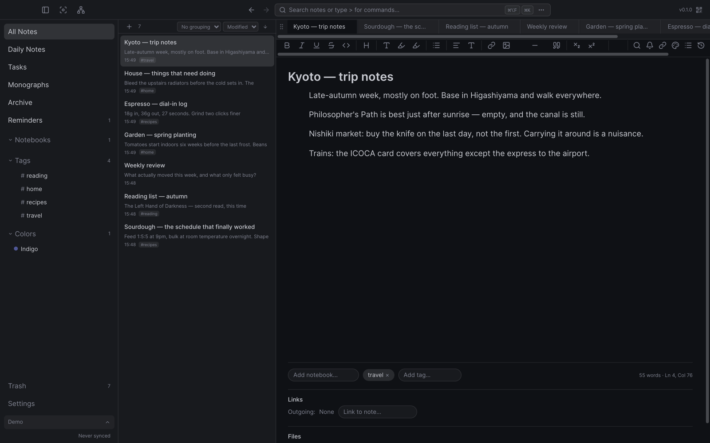
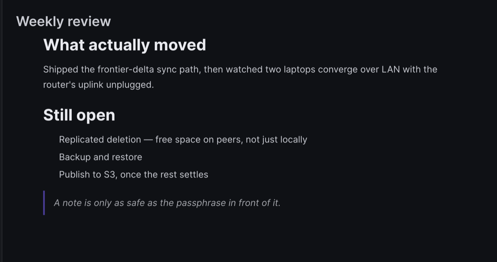
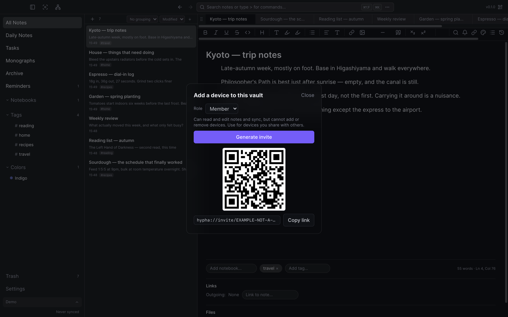
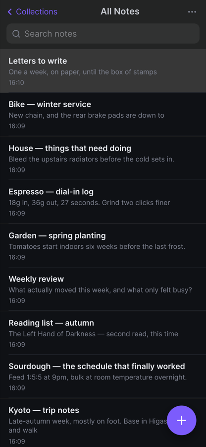
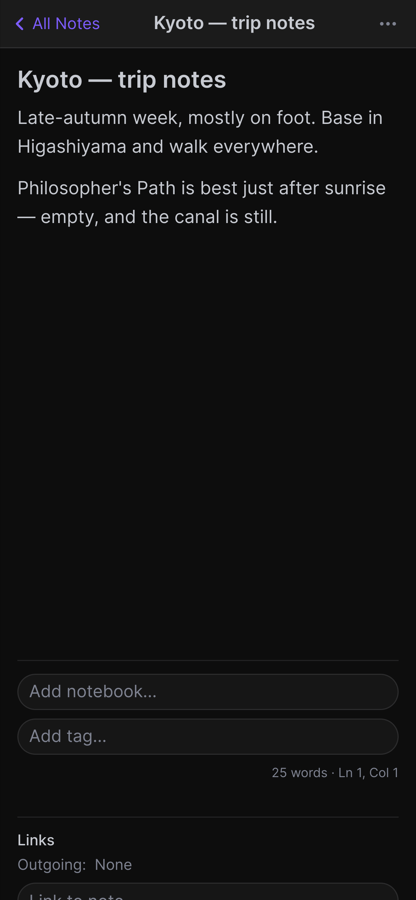

# hypha

hi, I'm hypha — local-first, end-to-end encrypted notes with peer-to-peer sync.

hypha is a notes application — desktop (Electron) and iOS (WKWebView) — where
your data lives on your devices, encrypted at rest with a key derived from your
passphrase, and syncs directly between your devices over an encrypted
peer-to-peer connection. No central server required.

| Light | Dark |
|---|---|
|  |  |

## Features

- **Local-first.** Your database lives on your device; reads and writes never
  block on the network.
- **End-to-end encryption at rest.** Every note's title, content, and
  attachments are encrypted with a per-note XChaCha20-Poly1305 key wrapped
  under an Argon2id-derived master key from your passphrase.
- **Peer-to-peer sync.** Devices sync notes, tags, notebooks, note content,
  and attachments directly over a Noise-secured connection (Hyperswarm DHT
  hole-punching + LAN discovery). No account, no server.
- **Conflict-free.** Note content is a Yjs CRDT; metadata and relations use a
  hybrid HLC / LWW-register / OR-set-tombstone layer — so concurrent edits on
  multiple devices converge without conflicts.
- **Links are relations.** A note→note link (typed with `@` or `[[`), an inline
  `#tag` chip, a notebook, a colour, an attachment and a reminder are all edges
  in one CRDT relation table — so backlinks come free, and links converge across
  devices by the same rules as everything else. Link to a note that does not
  exist yet and hypha writes it for you, inheriting the tags and notebooks of
  the note you linked from.
- **A map of your notes.** The relation table is a graph, so it can be drawn:
  the note map lays out notes and the edges between them, per vault, with the
  view options it remembers for each.
- **Search that reads the note, not the title.** Full-text search over note
  bodies (SQLite FTS5), plus search by *meaning* on the desktop over locally
  computed embeddings. Nothing is sent anywhere to make either work.
- **Content-addressed attachments.** Images, video, audio and documents are
  stored as deduplicated ciphertext blobs, transferred in chunks, and can carry
  tags, notebooks and colours of their own.
- **Notes that come to you.** Reminders that fire natively on both platforms,
  daily notes, note history you can restore from, templates, an archive and a
  trash — and web pages clipped into notes, sanitized on the way in.
- **Optional always-on relay.** `hypha-peer` is a headless, ciphertext-only
  store-and-forward daemon, so two devices that are rarely online together can
  still sync. It never holds a vault master key.
- **Publish without a backend.** A note can be published as a static page
  straight from the app to an S3 bucket you own (hand-rolled SigV4, no AWS SDK),
  optionally passphrase-encrypted so the bucket holds only ciphertext.
- **More than one vault.** Separate encrypted vaults, each with its own
  passphrase, peers and settings, switchable per window.

## The name

A *hypha* (plural *hyphae*) is one filament of a fungus: a single thread, one
cell wide, branching as it grows. Filaments meet and fuse, and the network they
form is the mycelium — the actual body of the fungus, spread through the soil,
with no trunk, no root and no centre. Nutrients and signals move along whatever
filaments happen to be connected; sever one and the rest carry on, and the whole
network can regrow from a surviving fragment.

That is the shape hypha is built in, in two places.

**Between devices.** Each device runs one node — one filament. Pair two and they
fuse into a network with nothing in the middle of it: every device holds the
entire vault, an edit made anywhere travels along whichever connections exist at
that moment, and edits reconcile where filaments meet rather than at a server
(which is what the CRDTs are for). Any one device can regrow the rest. The relay
daemon is not a centre either — just a filament that happens to always be there,
and one that can only carry ciphertext.

**Between notes.** The same shape runs one level down, in how notes hold on to
each other. There is no separate "links" feature: a note→note link, a tag on a
note, a notebook holding a note, a colour, an attachment and a reminder are all
one kind of thing — a row in a single general-purpose edge table (`meta_edges`),
untyped at the schema level and merged by the same CRDT rules as everything
else. Notebooks are the one place a hierarchy is imposed on top; underneath, it
is all the same undirected-in-practice tissue.

Two consequences worth naming:

- **Edges are read from either end.** A link is stored with a direction, but
  `relations.from` and `relations.to` both cost the same, so backlinks are not a
  feature that had to be built — they fall out of the substrate. Open a note and
  its References section shows what points at it, without anything having
  indexed the body.
- **Writing is growing.** Type `@` in a note and pick another, and the inline
  link and the edge appear together; delete the link text and the edge goes with
  it. Type `#` and the chip in the body *is* the tag relation the sidebar filters
  on — not a copy of it. The body and the graph are not two representations kept
  in step; the filament is the connection.

Hence `hypha://`, `@hypha/*`.

## Screenshots

*(These are from 2026-08-07 and predate the note map, phone-wide search and the
settings rework — the shell is the same, the detail has moved on.)*

The editor is TipTap over a per-note Yjs document — headings, lists and quotes
are CRDT structure, not stored markup:

Devices are paired to a vault by scanning or pasting a `hypha://invite` token —
there is no account to sign into. Roles are Member, Owner or Relay:

*(The invite shown above is a placeholder — a real one is a live credential.)*

The iOS shell reuses the same renderer in a swipe-stack layout:

| Notes | Editor |
|---|---|
|  |  |

## Download

**`0.13.0` was the first public build** — the beta; the newest is whatever the
Releases page marks *Latest*. Everything before `0.13.0` was a tag, not a
release: built on one machine, never signed for distribution, never uploaded
anywhere. `1.0.0` stays reserved for the release these are the rehearsal for.

macOS (Apple silicon) is at
**[Releases](https://github.com/marcolaux/hypha-releases/releases)** as a
notarized `.dmg`, beside unsigned Windows and Linux builds that are tested only
occasionally; iPhone is through **TestFlight**, by invitation. The
**[Install guide](INSTALL.md)** is the procedure for both.

Read **[Known limitations](KNOWN-LIMITATIONS.md)** before putting
anything in it you would be upset to lose — it is the one canonical list, and
the Status section below is its summary.

Problems and security reports: **[SECURITY.md](SECURITY.md)**.

## Status

**Beta.** The apps are real and are used daily by their author on a Mac and an
iPhone. Before `0.13.0` they had never been installed by anyone else, which is
precisely what the beta is for.

The desktop and iOS apps are functional, the data engine and encryption are
real, and peer-to-peer sync (META frontier delta + live push, per-note Yjs
updates, attachment exchange) is wired end to end over LAN and DHT, with tiered
tombstone/projection GC. The iOS shell runs on real hardware and converges with
a desktop peer in both directions, over both LAN and the DHT.

Three caveats that matter more than the feature list:

- the cryptography has **not** been independently audited;
- a backup file still contains the **vault credential**, and a host with no
  keychain slot for the backup key still writes the older format, which leaves
  tag and notebook names, reminder text and attachment filenames in the clear;
- desktop-to-desktop sync **over the internet** has never been run by anyone.
  Mac-to-phone has; Mac-to-Mac on a LAN has; across the internet is unproven.

**Onboarding & sync model.** hypha is local-first and peer-to-peer — there is
**no central server with login credentials**. First start creates a vault and an
encryption passphrase (the only credential); further devices and daemons are
added by pairing them as peers (`hypha://invite` tokens), not by signing in.
A "server" is just another node — the `apps/peer` relay daemon. Every vault is
the same kind of thing: local-first, encrypted at rest, and syncable to peers.
There is no separate "local" mode and no "synced" mode to choose between.

> **Upgrading from 0.18 or earlier?** Profiles are not migrated — see the
> changelog's *Existing installs must start fresh* note for the data paths.

## Architecture

- **Content** = a Yjs document per note (high-churn, multi-writer), live-bound
  to TipTap via y-prosemirror. FTS5 search and vector rows are Yjs-derived
  projections.
- **Metadata + relations** = CRDT-SQLite (low-churn, queryable, transactional).
- **Encryption** = per-doc XChaCha20-Poly1305 AEAD; Argon2id master key from a
  single passphrase; title encrypted too; Ed25519 device identity. The file
  layer underneath is PRAGMA-key encrypted.
- **Transport** = Hyperswarm (Noise XX, DHT hole-punching) for global reach plus
  a UDP-beacon LAN discovery (`UdpBeaconDiscovery`, the wired default — mDNS via
  `BonjourDiscovery` is still available but opt-in, since it can't browse
  cross-OS on macOS). On desktop this runs in the Electron main process; on iOS,
  Noise stays in the WebView over a native TCP/UDP byte relay.

## What is in this repository

There is **no source code here.** Hypha is source available, not open source,
and the source lives in a private repository. This one exists because GitHub
release assets inherit repository visibility: a private repo cannot serve public
downloads, and `electron-updater` cannot read an update manifest it needs a
token to fetch.

| File | What it is |
|---|---|
| [Releases](../../releases) | The installers, with `SHA256SUMS.txt` for each |
| [`CHANGELOG.md`](CHANGELOG.md) | Every user-visible change. The desktop app's *What's New* window fetches this file directly |
| [`KNOWN-LIMITATIONS.md`](KNOWN-LIMITATIONS.md) | What is wrong, missing or unproven — read before trusting it with notes |
| [`INSTALL.md`](INSTALL.md) | Installing a build, on each platform |
| [`SECURITY.md`](SECURITY.md) | What Hypha claims, what it does not, and how to report a vulnerability |
| [`privacy.md`](privacy.md) | The privacy policy the App Store listing points at |

Every file here is a **copy**, generated from the private repository by
`npm run release:changelog`. Edits made here are overwritten by the next sync.

## License

**Hypha Source Available License 1.0** — see LICENSE, NOTICE
and THIRD-PARTY.md.

This is **not** an open source license, and Hypha should not be described as
open source. It is source available. You may use Hypha for anything, including
at work; you may read it, change it, and share it and your changes with anyone,
at no charge. You may not charge for it, sell it, bundle it into something you
charge for, or defeat the mechanism that decides which features a user has.
Those rights stay with the copyright holder.

Versions 0.1.0–0.11.0 were released under AGPL-3.0-or-later. Those grants stand
for those versions and cannot be withdrawn.

---

*This page is generated from the source repository's `README.md`. The website is
[hypha.miniml.net](https://hypha.miniml.net).*
